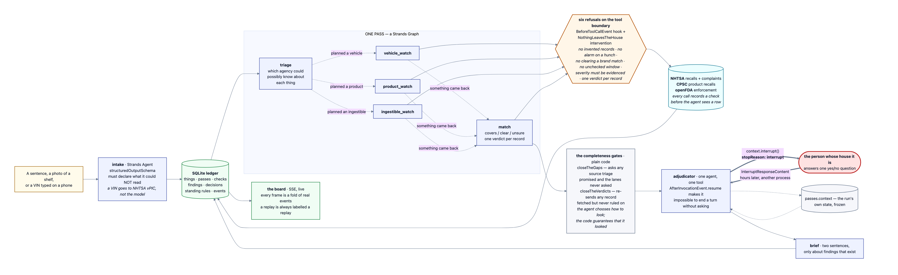

# Warden

**An autonomous operator for software that is already running.** It watches your services,
investigates them when they break, fixes what your policy lets it fix, proves the fix by re-running
the exact check that failed, and wakes you only when the decision is genuinely yours.

Live: **https://warden.80.225.209.190.sslip.io** (no sign-up) · Source:
**https://github.com/shariqazeem/warden** · MIT

Built on the **[Strands Agents SDK](https://github.com/strands-agents)** (TypeScript).

---

## Who this is for

A team of one to five people with something in production. They have monitoring — a ping, an uptime
check, a Slack webhook — and monitoring is a thing that wakes you up. It does not read the log. It
does not look at what deployed at 02:14. It does not restart the process that is simply stopped.
A person does that, at 3am, from a phone, and most of the time the person does the same four things
in the same order.

Warden does those four things. It stops where a human's judgement actually begins.

## The problem

The gap is not detection. The gap is the twenty minutes between "the check failed" and "somebody
who knows the system is awake and looking at it". In that gap the work is mechanical: is the process
running, what does the log say, what landed recently, does the smallest reversible act fix it.

The reason nobody automates it is that the automation is frightening. An agent with a shell on your
production box is a worse problem than the outage. So the whole product is the two boundaries:

- **The policy decides whether an act happens.** Per service, written by a human, in code —
  `src/lib/ops/policy.ts`. `may` → Warden does it and tells you. `ask` → Warden works out exactly
  what it would do, then stops the run and asks. `never` → refused, with the rule named. Plus an
  action cap per incident and a cooldown per service, because a granted permission is not an
  unbounded one.
- **The probe decides whether it worked.** `settle()` in `src/agent/warden.ts` re-runs the exact
  check that opened the incident. An incident is closed only by a clean reading, and the reading's
  id is stored on the incident as `verifiedByReadingId`. Warden does not get to say it fixed
  something.

Underneath the policy: **Warden has no shell.** It invokes named operations from a fixed catalogue,
with arguments validated by zod, spawned with `execFile`. No shell string is ever composed.

## Try it in 60 seconds

**Watch it, no setup.** <https://warden.80.225.209.190.sslip.io> — the fleet is public, no sign-up.
Open any incident: the timeline is what Warden did, and the table at the bottom is every command it
ran with the policy rule that permitted each one.

**Then use it.** Press *Watch something of yours* and give it a URL. That is the whole sign-up: a
signed cookie makes the service yours, and the next sweep picks it up. Everything after that is in
the console — the policy editor (all sixteen operations, each with a sentence saying what granting
it means), adding and retiring checks, *check it now* streaming each probe as it answers, and
`/settings` for where Warden should reach you when it stops to ask. Nothing about running Warden
requires a terminal; the CLI still exists and does the same things, because the same functions are
behind both.

**Prove the boundaries on your own machine.** No network, no model, no API key, nothing spawned:

```bash
npm install --legacy-peer-deps
npx vitest run
# 11 files, 228 tests, ~1s

npx vitest run src/agent/__tests__/gates.test.ts
# the red team: a jailbroken sequence pushed through the real hooks and the real tools
```

**Run the operator.** `.env` needs one model endpoint (see [Setup](#setup)):

```bash
npx tsx --env-file=.env scripts/warden.ts register      # register a fleet and its probes
npx tsx --env-file=.env scripts/warden.ts sweep         # ask every probe once; open incidents
npx tsx --env-file=.env scripts/warden.ts handle <id>   # work one incident, printed as it happens
npx tsx --env-file=.env scripts/warden.ts answer <decisionId> approve
npx tsx --env-file=.env scripts/warden.ts policy <svcId> may|ask|observe
npx tsx --env-file=.env scripts/warden.ts show          # the fleet, its probes and its incidents
```

## The console

The web app is the product, not a view of it. Every page calls the same functions the CLI does.

| | |
| --- | --- |
| `/` | Your fleet and the public one, kept apart. Live probe history per check, the postures, and *check everything now* — the same sweep the cron runs, streamed as each probe answers. A halted run is the one thing this page is ever loud about. |
| `/new` | Register something. A URL is a complete registration; a machine, a checkout and a pm2 process are what turn a watch into an operator. The posture is three sentences rather than sixteen switches, because nobody choosing this for the first time can judge whether `redeploy_previous` belongs in `ask`. |
| `/s/[id]` | **The policy editor.** All sixteen operations, each with a sentence saying what granting it *means*, the action cap, the cooldown and the note. The four forbidden operations are shown locked rather than hidden. Nothing is applied until you press save. Also: add and retire checks, check it now, pause, delete. |
| `/i/[id]` | One incident, live over SSE. Hand it over, watch it work, answer it when it stops — and every command at the bottom with the rule that permitted it. |
| `/activity` | Every operation across every service, newest first, refusals as prominent as acts. |
| `/settings` | Where Warden should reach you. |

**Writing from a browser is a different threat model from editing a file on the server**, and the
new surface is built around three boundaries with a test file that attacks each
(`src/app/api/__tests__/writes.test.ts`):

- **`canEdit` is not `canView`.** The public fleet is readable by anyone and writable by nobody. A
  stranger — or a visitor holding a perfectly valid cookie of their own — cannot take SAGE off
  `OBSERVE_ONLY`, add a check to it, or delete it.
- **A probe is a server-side fetch on a timer**, which is the shape of every SSRF. The cloud
  metadata addresses are refused on every instance, always. Everything else private is refused
  unless the operator sets `WARDEN_ALLOW_PRIVATE_TARGETS=1`. (Node keeps the brackets on an IPv6
  hostname, which let `[fd00:ec2::254]` past the always-refuse rule until a test caught it.)
- **A form never names an ssh key file.** Keys are chosen by nickname from `WARDEN_SSH_KEYS`, and
  only the server knows the path. Unset — which is what the public instance runs — the console can
  register services watched over http but cannot reach a machine.

A policy arriving from a form is also sanitised before it is stored. Not because `decide()` would
honour a forbidden operation — it refuses them by risk, whatever the policy says — but because a
stored policy claiming to grant `delete_data` would be *rendered* as granted, and somebody would
reasonably believe they had granted it.

## Being woken

"It wakes you only when the decision is genuinely yours" was, for most of this project's life, a
description of a screen: the run halted, a card appeared, and it sat there until somebody happened
to look. An operator that cannot reach you has not woken you.

An address is a URL Warden POSTs JSON to (`/settings`). Slack and Discord incoming webhooks are
exactly that, and so is anything you write yourself — so no credential is stored beyond the URL. One
payload carries the structured fields plus a `text` field Slack renders and a `content` field
Discord renders, which is how one address shape reaches both without Warden knowing which it is
talking to.

Four moments send: **it stopped to ask you**, **it acted and the check still fails**, **it is
handing the problem back**, and — only to addresses that asked for everything — **it fixed something
and proved it**. Being told about something already fixed is news, not an interruption.

Two rules matter more than the feature. Delivery never fails a run, so a dead webhook cannot turn a
fixed incident into an error. And every attempt is written down, success or not, because a hook that
silently stopped working otherwise looks exactly like a quiet night — `/settings` shows the last
result per address and has a button that sends a real one now.

## What it watches right now

One VM, three real services, over ssh:

| Service | Policy | Why |
| --- | --- | --- |
| Warden's own console | `ASK_BEFORE_ACTING` | It may diagnose itself and show exactly what it would run, but not restart itself unasked: an operator that reboots the machine it is reasoning on loses the run it was in the middle of. |
| Vigil | `DEFAULT_POLICY` | A real public Next.js service. If it is down, visitors get nothing. It may restart itself; anything that does not undo itself is an `ask`. |
| SAGE | `OBSERVE_ONLY` | Someone else's production, submitted to two other competitions. Every read allowed, every act refused by name. |

SAGE is the interesting one. It is a live service this builder does not operate, and it is entered
in competitions where a stray restart would be a real problem. Its policy grants every read and
names every act under `never`, with `maxActionsPerIncident: 0`. Warden probes it, and if it broke,
Warden would investigate it and write down what it found — and then stop, because the policy's
`never` list is consulted before anything else the policy says. The card in the console reads
`observe only`. That is not a setting for a demo; it is how you point an operator at something you
are allowed to look at and not allowed to touch.

## Architecture

```mermaid
%% Warden — how one incident is actually handled.
%% Dotted = a CONDITIONAL EDGE the Strands Graph evaluates at run time.
%% Thick  = the interrupt: the run genuinely stops there until a human answers.
%% Render: node scripts/render-diagram.mjs
flowchart LR

  subgraph SWEEP["THE SWEEP · pm2 cron, every 10 min, no model"]
    direction TB
    PROBE["probe a service<br/><i>http · process</i>"]:::code
    READ[("readings<br/><i>every answer, including<br/>the boring ones</i>")]:::store
    OPEN{"failed twice<br/>in a row?"}:::gate
    PROBE --> READ --> OPEN
  end

  OPEN -. "no — nothing to say" .-> QUIET(["it has been fine"]):::quiet
  OPEN == "yes" ==> INC[("incident opened")]:::store

  subgraph GRAPH["ONE INCIDENT · a Strands Graph"]
    direction LR
    INV["<b>investigate</b><br/>read_incident, look ×10<br/>commits to a cause<br/>and a confidence"]:::agent
    REM["<b>remedy</b><br/>chooses the SMALLEST act<br/>the diagnosis supports"]:::agent
    INV -. "diagnosis recorded<br/>AND confidence ≥ 0.5" .-> REM
  end

  INC --> INV

  GUARD{{"<b>four rules no policy can switch off</b><br/>no operation that does not exist ·<br/>no acting before diagnosing ·<br/>no second go at the same act ·<br/>no acting past a refusal"}}:::gate

  POLICY{{"<b>THE POLICY</b> — per service, written by a human<br/>may → do it · ask → stop and ask · never → refuse<br/><i>plus an action cap and a cooldown</i>"}}:::policy

  CAT[("<b>the catalogue</b> — 16 named operations<br/>zod-validated args, spawned with execFile<br/><i>there is no shell, and no way to compose one</i><br/>4 are forbidden to every policy")]:::src

  INV --> GUARD
  REM --> GUARD
  GUARD --> POLICY
  POLICY -- "allow" --> CAT
  POLICY -- "refuse" --> SAID(["refused, and the rule is named"]):::quiet

  HUMAN(["<b>a human</b><br/>approves, or does not"]):::human
  POLICY == "ask · context.interrupt()<br/><b>stopReason: interrupt</b>" ==> HUMAN
  HUMAN == "InterruptResponseContent<br/>hours later, another process" ==> REM
  REM -.-> SESS[("the session, on disk")]:::code
  SESS -.-> REM

  CAT --> SYS(["the running service"]):::src

  VERIFY["<b>re-run the check that failed</b><br/><i>code, not a model</i>"]:::code
  CAT --> VERIFY
  VERIFY -- "clean" --> FIXED(["resolved · the reading is the proof"]):::ok
  VERIFY -- "still failing" --> ESC(["escalated · Warden does not claim a fix"]):::quiet

  AUDIT[("<b>every call, with the rule that permitted it</b><br/>op · risk · verdict · argv · exit code · ms")]:::store
  GUARD --> AUDIT
  POLICY --> AUDIT
  VERIFY --> AUDIT

  classDef agent fill:#eeeefb,stroke:#3f3cbb,stroke-width:1.5px,color:#14161a;
  classDef code fill:#f4f5f7,stroke:#5a616c,stroke-width:1.5px,color:#14161a;
  classDef gate fill:#fdf3e7,stroke:#a8620a,stroke-width:1.5px,color:#14161a;
  classDef policy fill:#fdf3e7,stroke:#a8620a,stroke-width:2.5px,color:#14161a;
  classDef store fill:#eaf6f0,stroke:#0f7a4d,stroke-width:1.5px,color:#14161a;
  classDef src fill:#eef7fb,stroke:#0e7490,stroke-width:1.5px,color:#14161a;
  classDef human fill:#fdeded,stroke:#c22a2a,stroke-width:2.5px,color:#14161a;
  classDef ok fill:#eaf6f0,stroke:#0f7a4d,stroke-width:2.5px,color:#14161a;
  classDef quiet fill:#ffffff,stroke:#b4bac3,stroke-width:1.2px,color:#5a616c;
```



<details>
<summary>The same diagram as Mermaid source (<code>docs/architecture.mmd</code>)</summary>



</details>

Three layers, and only the middle one has a model in it.

**The sweep** (`src/lib/ops/sweep.ts`, `scripts/sweep.ts`) asks every probe on every service and
writes down the answer, including the boring ones — "it has been fine for nine hours" is a claim
that needs rows behind it. An incident opens once a probe has failed its own threshold of times in a
row (`failuresToOpen`, two by default), so one blip is not an outage. Nothing here reasons. pm2 runs it every ten minutes (`cron_restart: "*/10 * * * *"` in
`ecosystem.config.cjs`) and hands each new incident straight to the agent with nobody present. That
cron entry is the difference between an operator and a button.

**One incident** (`src/agent/warden.ts`) is a Strands `Graph` with two agents. `investigate` gathers
evidence and must call `record_diagnosis` before it can finish. A conditional edge runs `remedy`
only when a diagnosis exists and its confidence is at least `CONFIDENCE_TO_ACT` (0.5); otherwise the
incident is escalated with the evidence attached. `remedy` chooses the smallest act the diagnosis
supports and calls `act`, where the policy decides.

**The verdict** is `settle()`. It re-runs the failing probe. Clean reading → resolved, with that
reading recorded as the proof and the outage measured from the incident's open to the reading.
Anything else → escalated, with the reason in plain words.

The two agents never hand each other prose. They read and write one incident context through tools
(`src/agent/incident-context.ts`), so the evidence Warden cites is the evidence it actually
collected, and the count of what it has already changed — which the policy's cap reads — is kept by
code rather than remembered by a model.

## How the Strands Agents SDK is used

Every row is a feature doing load-bearing work, not a feature switched on to be able to say so.

| SDK feature | Where | What it does here |
| --- | --- | --- |
| `Graph` (multi-agent) with a **conditional edge** | `src/agent/warden.ts` | Two agents, `investigate` → `remedy`. The edge handler reads the live incident context and returns false unless a diagnosis was recorded with confidence ≥ 0.5. Warden cannot act on a hunch, because the hunch never reaches the agent that can act. |
| **Tools instead of `structuredOutputSchema`** | `src/agent/tools.ts` | The investigation's output is a `record_diagnosis` tool call, not a structured-output schema on the final message. The diagnosis has to be committed mid-run, where the graph's edge, the `act` guard and the incident row can all read it — a schema on the last message would arrive too late for any of them. |
| **Tool-raised `context.interrupt()`** | `src/agent/tools.ts` (`act`) | When the policy says `ask`, the tool raises a real interrupt from inside the callback. The run genuinely stops, `stopReason: "interrupt"`, with the question written to the decisions table. |
| **`InterruptResponseContent` resume** | `src/agent/warden.ts` (`resumeWithAnswer`) | Hours later and in another process, the owner's answer is handed back as the tool's return value and the agent finishes the thought it was having. |
| **`SessionManager` + `LocalFileStorage`** | `src/agent/warden.ts` | The remedy agent's conversation is persisted so a halted run outlives the process that started it. It is deliberately cleared on a *fresh* attempt at the same incident and kept on a *resume*: an agent that reads its own earlier "I could not do anything here" simply says it again, which is what happened the first time this was built. |
| **`AfterInvocationEvent` with `e.resume`** | `src/agent/warden.ts` | An investigation that ends without a diagnosis, or a remedy that ends having neither acted nor explained itself, is sent back once with a specific instruction. Silence at 3am is the one outcome that helps nobody. |
| **`BeforeToolCallEvent` / `AfterToolCallEvent` hooks** | `src/agent/guards.ts` | The four rules no policy can switch off (below). `BeforeToolCallEvent` at `HookOrder.SDK_FIRST - 1` sets `e.cancel`, so the tool never runs; `AfterToolCallEvent` reads the result and remembers a refusal. |
| **`InterventionHandler`** (`TwoHandsOnly`) | `src/agent/guards.ts` | States the shape of the product declaratively: six tools are allowed, and anything whose *name* suggests a shell (`shell`, `bash`, `exec`, `sudo`, `ssh`, `curl`, `python`, `eval`, …) is denied before it can be wired up. Registered on both agents as `interventions: [new TwoHandsOnly()]`, and proven in `guards.test.ts` and `gates.test.ts`. |
| **`InvokeModelStage` middleware** | `src/agent/throttle.ts` | One queue for every model call in the process. Several incidents can be live at once; the fan-out stays and the gateway sees a bounded queue. A 429 waits and comes back rather than failing a node. |
| **`ModelRouter` + `FallbackStrategy`** | `src/agent/model.ts` | With `BEDROCK_MODEL_ID` set, Amazon Bedrock is the primary candidate and the OpenAI-compatible gateway is the fallback, `maxSwitches: 2`. A watch that runs for years cannot go dark because one provider does. |
| **`BedrockModel`** with prompt caching | `src/agent/model.ts` | `cacheConfig: { strategy: "auto" }` — the system prompts are long and identical across a pass. |
| **`DefaultModelRetryStrategy` + `ExponentialBackoff`** | `src/agent/model.ts` | 4 attempts, decorrelated jitter, 500ms–20s. Constructed per agent, never shared. |
| **`SlidingWindowConversationManager`** | `src/agent/warden.ts` | `windowSize: 16, pinFirst: 1` on the investigator. Logs and diffs are large; what falls out of the window is still in the evidence list, which `read_incident` hands back on demand. |
| **`ToolStreamEvent`** | `src/agent/tools.ts` (`look`) | The tool yields before it spawns, so the console can show what Warden is doing while it is doing it rather than after. |
| **`BeforeNodeCallEvent`** | `src/agent/warden.ts` | Graph-level hook that emits "Looking at it" / "Deciding what to do" to the live timeline. |
| **`traceAttributes` / `invocationState`** | `src/agent/warden.ts`, `tools.ts`, `guards.ts` | `invocationState` carries the incident id into every tool and hook, which is how a tool knows which incident it is allowed to touch; `traceAttributes` tag the graph and each node with the incident and service. |

Model: the deployed instance runs **MiniMax-M3** through an OpenAI-compatible endpoint. Bedrock is
wired and switches on with `BEDROCK_MODEL_ID`, but **the live instance is not on Bedrock**. The
console prints which model actually ran each pass (`modelLabel()`), so the screen cannot claim
otherwise.

## What Warden is not allowed to do

Four rules in `src/agent/guards.ts`, enforced in a `BeforeToolCallEvent` hook before the tool runs:

1. **No operation that does not exist.** The catalogue is the whole surface. A name that is not in
   it is refused before anything is spawned.
2. **No acting before diagnosing.** `act` without a recorded diagnosis is refused. An agent that
   restarts things to see what happens is not an operator.
3. **No second go at the same act.** The same operation with the same arguments, twice on one
   incident, is refused. The loop that creates is the most likely way an autonomous operator does
   real damage.
4. **No acting past a refusal.** Once an operation has been refused on this incident, it cannot be
   re-attempted with different wording.

**The catalogue** (`src/lib/ops/operations.ts`) is 16 named operations: 8 `read`
(`http_probe`, `pm2_list`, `pm2_logs`, `git_log`, `git_show`, `read_file`, `grep_repo`,
`disk_free`), 3 `reversible` (`pm2_restart`, `pm2_start`, `run_tests`), 1 `disruptive`
(`redeploy_previous`), and 4 `forbidden` — `db_migrate`, `delete_data`, `rotate_secret`,
`destroy_infra`. The forbidden four are **declared rather than omitted**, so the product can show
you the line. `decide()` refuses forbidden risk before it consults the policy at all, so no policy
can grant them, and `execute()` refuses them again if called directly.

Also in code, not in a prompt: file paths are resolved inside the service's own checkout or the
operation fails (`insideRepo`); a process name or git ref carrying a shell metacharacter fails its
zod schema; and an `http_probe` may only be pointed at an origin this service's own probes already
use, so "look at a URL" is not a request to fetch anything from wherever Warden runs.

**The command that proves it:**

```bash
npx vitest run src/agent/__tests__/gates.test.ts
```

That file takes a deliberately jailbroken sequence — an invented operation, a forbidden one, an act
before any diagnosis, an act smuggled through the read-only hand, a probe pointed at the cloud
metadata endpoint — and pushes each through the **real** hook and the **real** tool callback in the
order the agent loop runs them. `execFile` is replaced with a recorder and `fetch` with a spy that
throws, so after each attempt the test asserts *nothing was spawned*, *nothing left the machine*,
*no model was called*, and *no row was written to the audit table*. Then it runs a control — a
legitimate look, a diagnosis, an allowed restart — which does run and does write, because a
red-team test that passes against a broken harness proves nothing.

The whole suite is 228 tests across 11 files, about a second, fully offline: no network, no model,
no process spawned.

## How it knows it worked

An incident is a failing probe. The probe is a question with a right answer — an HTTP status and an
optional string, or a pm2 process being `online`. When Warden has acted, `settle()` runs *that same
probe again*, through the same code the sweep uses:

```ts
const reading = await verifyIncident(ctx.service, incident, (e) => ctx.emit(e));
...
if (reading.ok) {
  resolveIncident(ctx.incidentId, reading, resolution);
```

`resolveIncident` writes `verifiedByReadingId` onto the incident and measures `downSeconds` from
the incident's open to *the reading that proved it back* — not to the moment of the fix, which is
the number an agent would prefer to report. If the reading is not clean, or if the probe cannot be
re-run at all, the incident is escalated and says so: "Warden acted, but the check still fails …
It is not calling this fixed."

**One real run, from the audit table.** Vigil was stopped on purpose. Warden read the process table
and the logs, then committed to a cause at 55% confidence:

> The site is returning 502 because the upstream process is not running. pm2 reports the vigil
> process with status "stopped" (lastStartedAt 2026-09-14T07:30:38Z, restartsSinceAdded 4). … Time
> alignment: pm2 last tried to start it at 07:30 UTC, which is after the check started failing at
> 07:03 UTC … The most recent commit touching the agent runtime is 6fad866 … plausible suspect, but
> I have not confirmed it actually crashed this process.

The policy returned `allow` under rule `policy-may`. Warden ran `pm2_start` — `start vigil · on
ubuntu@80.225.209.190` — which came back ok in **712ms**. Then it re-ran the failing check and got
**`200 in 1423ms`**, and the incident closed: down 1300s. An earlier, identical outage closed at
140s down, with the same operation and `200 in 1044ms`.

Two details from that run worth more than the happy path. The investigation tried to read
`/home/ubuntu/.pm2/logs/vigil-error.log`; the operation refused it — *path escapes the service
checkout* — and the agent worked with what it was allowed to read. And the diagnosis names a suspect
commit while explicitly declining to blame it. That is the tone the product is built for.

## What is honest about this

- **It is six days old**, written by one person: first commit 8 September 2026, this one today.
- **It has fixed one class of failure in production: a process that is down.** The catalogue can
  also run tests and roll back to the previous build; neither has been the thing that fixed a real
  incident yet. `redeploy_previous` is `ask` in the default policy and has not been exercised
  against a real outage.
- **The halt has now fired on the live fleet, and the first one failed.** A restart fell inside the
  cooldown, the policy said `ask`, and the run genuinely stopped holding a question — that part
  worked. Answering it did not: the Strands interrupt id was held only in the memory of the process
  that raised it, which was the sweep's, and it had exited. The answer arrived from another process
  and the SDK threw `Agent is in an interrupted state`. The session on disk had always held the
  answer; `resumeWithAnswer` now replays it with `initialize()` and asks the restored agent which
  interrupt it is still holding. The same decision, answered again, ran the act in 318ms, re-ran the
  check, got `200 in 310ms`, and closed an incident that had been open 17 minutes. So the path is
  proven end to end on production now — but it is worth knowing it was proven by breaking first, and
  that the test suite had not caught it, because every test resumed inside the process that halted.
- **Confidence is the model's self-report.** The 0.5 floor stops the obviously unsure from acting;
  it does not make a confident wrong answer right. What catches that is the probe, afterwards.
- **A diagnosis can be wrong and the fix still work.** The run above is an example: the cause of the
  stop was never established. Warden said so, acted on what it could establish, and the check
  decided.
- **There is no sign-up and the public fleet is public on purpose** (`canView` treats the owner key
  `demo` as public; `canEdit` has no such branch). Anything you register yourself is behind a signed
  HMAC cookie. That is enough to keep one visitor's services out of another's hands and it is not
  enough for a product with customers: clear the cookie and the services are unreachable, there is
  no way to sign in from a second device, and nothing is encrypted at rest.
- **Notifications go one way.** Warden posts to a webhook. It does not know whether a human read it,
  it does not retry a failed delivery, and it has no escalation after the first message — the record
  of the attempt on `/settings` is the whole story.
- **The unattended runs are capped at 100 per owner per day** (`WARDEN_AUTO_HANDLE_DAILY`). Past
  that the incident still opens and still waits on the board with a button; only the part that
  happens while nobody is looking stops. This exists because the console lets anyone register a URL,
  and a URL that is always down would otherwise spend the model budget forever.
- **Bedrock is wired but not what runs live.** Stated again here because it is the kind of thing a
  README is tempted to blur.
- **One VM, three services, SQLite.** Nothing here has been tested at a scale it does not have.

## Setup

Node 22 or newer (the Strands SDK requires it).

```bash
npm install --legacy-peer-deps   # the SDK's optional peers conflict under strict resolution
cp .env.example .env             # fill in one model endpoint
npm run dev -- -p 3100           # the console
npx vitest run                   # the suite, offline
npm run typecheck && npm run lint
```

Environment, in full, is documented in [`.env.example`](.env.example). Only the model endpoint is
required: `LLM_BASE_URL`, `LLM_API_KEY`, `LLM_MODEL` (any OpenAI-compatible gateway), or
`BEDROCK_MODEL_ID` plus AWS credentials for Amazon Bedrock. Everything else has a working default.

To watch a service over ssh, register it with a host and a key Warden already holds
(`WARDEN_HOST`, `WARDEN_SSH_KEY`); operations are handed to `ssh` as argv, never as a composed
command line, and one multiplexed connection is reused across an investigation.

In production, pm2 runs two apps from `ecosystem.config.cjs`: `warden` (the console) and
`warden-sweep` (the watch, `*/10 * * * *`).

## Prior work and disclosures

- This repository began on **8 September 2026** as a different product and was re-aimed twice before
  it became Warden. The git history is public and intact, and the earlier commits say plainly what
  they were. Warden is the third thing this codebase has been, and the first two are still visible
  in it: the design tokens, the SQLite-plus-drizzle ledger shape, the SSE console and the Strands
  plumbing were carried forward rather than rewritten. The operator itself — the catalogue, the
  policy, the guards, the graph, the verify step and every test named above — is new.
- **SAGE**, one of the three watched services, is a separate project by the same builder, entered in
  two other competitions. It is watched under `OBSERVE_ONLY`, which is why it is in the fleet: it is
  the honest case for a policy that only reads.
- **Vigil** is likewise an earlier project by the same builder, running on the same VM. It is the
  service that is stopped on purpose in the demo.
- Written solo, with AI coding assistance (Claude Code). The commit history records it.
- Third-party work: the Strands Agents SDK (Apache-2.0), Next.js, drizzle, better-sqlite3, zod,
  vitest. pm2 is the process manager Warden reads and acts through; it is not bundled.

## Licence

MIT. See [LICENSE](LICENSE).
